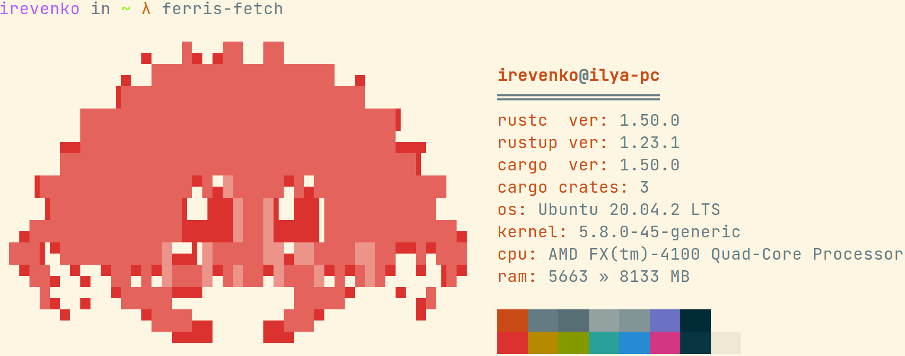

# 🎨🦀 ferris-fetch
> Inspired by <a href="https://github.com/Gyro7/gofetch">gofetch 💖</a>

<p align="center"></p><br>

# Installation 🔨
```cargo install ferris-fetch``` <br>

# Contributing 🤝
Contributions, issues and feature requests are welcome! 👍 <br>
Feel free to check [open issues](https://github.com/irevenko/ferris-fetch/issues).

# Quick Start 🚀
```git clone https://github.com/irevenko/ferris-fetch.git``` <br>
```cd ferris-fetch``` <br>
```cargo build``` <br>

# What I Learned 🧠
- Rust basics

# License 📑 
(c) 2021 Ilya Revenko. [MIT License](https://tldrlegal.com/license/mit-license)
